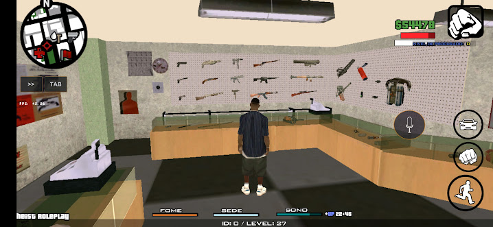
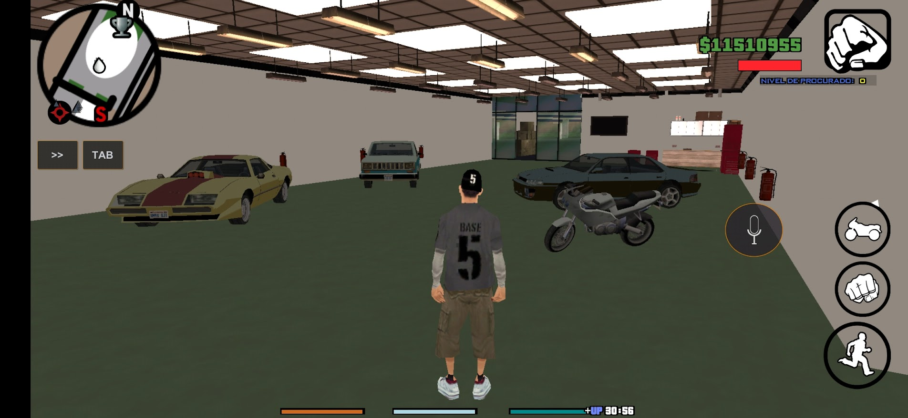
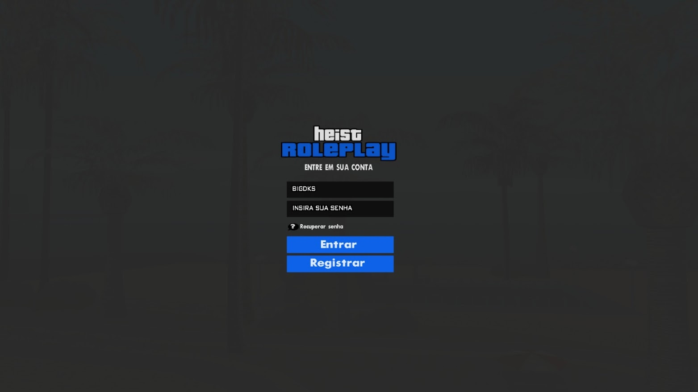
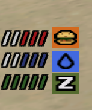

# Portfólio (Bigdk)

Olá, sou o Bigdk, sou scripter, mapper e criador de textdraws para SA-MP. Aqui eu estou postando meu portfólio para demonstrar meus trabalhos feitos, também aqui nesse GitHub, compartilho alguns conteúdos gratuitos.

### Sistemas completos

#### Ammu Nation do GTA V
---

_Sistema completo de Ammu-Nation com o sistema igual do GTA V, podendo fazer compras, selecionar armas e etc..._

_Sistema completo de Level igual o GTA V Online, esse é gratuito e você pode usar [Clique aqui](caminho/para/outro_arquivo.md)_

### Mapas

_(Favela mapeada com campo de futebol)_
---
 

_(Garagem do GTA V Online)_
---
  

### TextDraws

_(Tela de Login)_
---

_(TextDraw de Some/Sede/Sono)_
---

_(Celular Funcional)_
---

ng" alt="alt text" width="256" height="512">ng" alt="alt text" width="256" height="512">