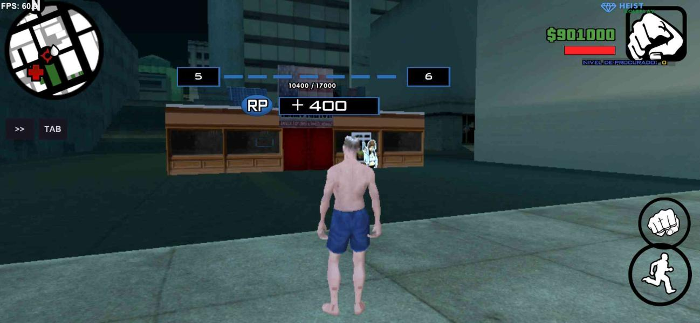

# Sistema de Level SAMP
 Sistema de level SA-MP, baseado no sistema de level do GTA V Online.

* **Funcionalidades:**
  
* Sistema identico ao GTA V Online. Cada experiência necessária para avançar de level é exatamente igual.
* Script comentado, então não terá problemas em adaptar para sua gamemode.

# TextDraw



[Abrir Código-Fonte](SistemaLevel.pwn)

# Exemplos

O jogador completou uma missão, concluiu um serviço, ou algo semelhante, simplesmente inclua esse código para dar experiência para ele:

 ```
 DarXP(playerid, 1000); // Aqui dá 1000 de experiência para o playerid
 ```

## Arquivos necessários: 


* sscanf2 - Y_Less

(Adicionei a include izcmd para fins de testes com os comandos para testar)